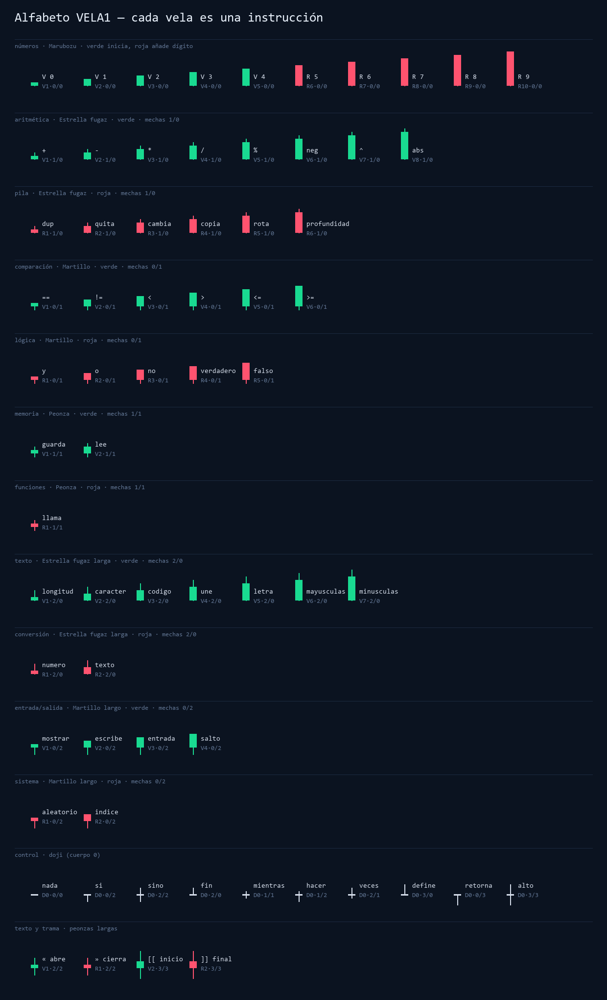
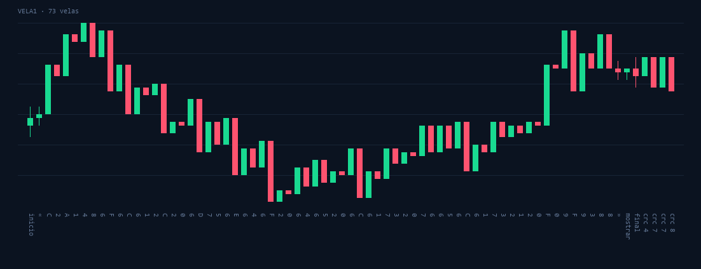
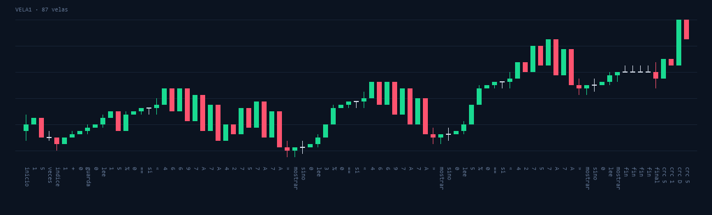

# CandleLab · VELA

**Un lenguaje de programación en el que cada vela japonesa es una instrucción.**

Escribes un programa, CandleLab lo convierte en un gráfico de velas (SVG, PNG, CSV o
Pine Script para TradingView) y cualquier lector recupera el programa **solo a partir de
la forma de las velas**: color, cuerpo y mechas. El gráfico también se puede emitir **en
directo** como si fuera un activo cotizando. Quien lo mire en otro equipo verá un
gráfico de mercado normal, pero su receptor lo irá leyendo, comprobará el CRC y mostrará
el mensaje.



El proyecto contiene tres sistemas:

| Sistema | Qué es | Protocolo |
|---|---|---|
| **VELA** | Lenguaje de programación completo: cada vela es una instrucción | `VELA1` |
| CandleHex | Comunicación de texto UTF-8 con alturas 2ⁿ | `HEX1` |
| CandleScript | Programas de texto codificados en bits, con velas reservadas para palabras clave | `SCR1` |

La mayor parte de este documento trata de VELA. CandleHex y CandleScript se describen al
final, en [Protocolos anteriores](#protocolos-anteriores-hex1-y-scr1).

---

## Índice

1. [Instalación](#instalación)
2. [Primer programa en 60 segundos](#primer-programa-en-60-segundos)
3. [Anatomía de una vela](#anatomía-de-una-vela)
4. [Tabla completa de instrucciones](#tabla-completa-de-instrucciones)
5. [Cómo se programa](#cómo-se-programa)
6. [Trama y control de errores](#trama-y-control-de-errores)
7. [El intérprete de imágenes](#el-intérprete-de-imágenes)
8. [Mensajes en vivo sobre un gráfico real](#mensajes-en-vivo-sobre-un-gráfico-real)
9. [TradingView y datos de mercado](#tradingview-y-datos-de-mercado)
10. [Referencia de la línea de órdenes](#referencia-de-la-línea-de-órdenes)
11. [Ejemplos incluidos](#ejemplos-incluidos)
12. [Arquitectura](#arquitectura)
13. [Límites y seguridad](#límites-y-seguridad)

---

## Instalación

1. Instala **Python 3.11 o posterior** y marca la opción de añadirlo al `PATH`.
2. Ejecuta `instalar_windows.bat`, que instala Pillow.
3. Abre la aplicación que quieras:

| Lanzador | Abre |
|---|---|
| `iniciar_vela_windows.bat` | Editor VELA: escribir, ver las velas, ejecutar, exportar |
| `iniciar_vivo_windows.bat` | Gráfico en vivo en el navegador para emitir y recibir mensajes |
| `iniciar_hex_windows.bat` | CandleHex |
| `iniciar_script_windows.bat` | CandleScript |

En macOS o Linux: `python3 -m pip install -r requirements.txt` y después
`python3 -m candlelab vela`.

## Primer programa en 60 segundos

```text
"¡Hola, mundo de las velas! 📈" mostrar
```

```powershell
py -m candlelab vela compila ejemplos\hola.vela hola.png --etiquetas
py -m candlelab vela ejecuta hola.png
```

El segundo comando no lee ningún texto guardado. Lee los píxeles de la imagen, reconstruye
cada vela, comprueba el CRC y ejecuta el programa:



---

## Anatomía de una vela

Cada vela se reduce a su **firma**, cuatro números enteros medidos en *unidades*:

```
        │  ← mecha superior  (0–3 unidades)
      ┌─┴─┐
      │   │ ← cuerpo         (0–16 unidades)
      └─┬─┘
        │  ← mecha inferior  (0–3 unidades)

  color:  V = verde (cierre > apertura)
          R = roja  (cierre < apertura)
          D = doji  (cierre = apertura, cuerpo 0)
```

La firma se escribe `color+cuerpo·superior/inferior`. Por ejemplo, `V1·0/2` es una vela
verde de cuerpo 1, sin mecha superior y con una mecha inferior de 2 unidades. Es
`mostrar`.

**Regla para leer cualquier vela:**

> **Las mechas eligen la familia. El color elige el grupo. El cuerpo elige la instrucción.**

| Mechas (sup/inf) | Patrón | Verde | Roja |
|---|---|---|---|
| 0/0 | **Marubozu** | inicia un número (dígito = cuerpo−1) | añade un dígito al número |
| 1/0 | **Estrella fugaz** | aritmética | pila |
| 0/1 | **Martillo** | comparación | lógica |
| 1/1 | **Peonza** | memoria (variables) | funciones |
| 2/0 | **Estrella fugaz larga** | texto | conversión |
| 0/2 | **Martillo largo** | entrada/salida | sistema |
| 2/2 | **Peonza larga** | « abre un texto | » cierra un texto |
| 3/3 | **Peonza extrema** | ⟦ inicio de trama | ⟧ fin de trama |
| cuerpo 0 | **Doji** | control de flujo (según sus mechas) | |

Además, el gráfico es **continuo**: cada vela abre exactamente en el cierre de la anterior,
como en un gráfico de mercado real. Los lectores lo verifican.

---

## Tabla completa de instrucciones

Notación de pila: `a b → c` significa que la instrucción toma `a` y `b` (b es la cima) y deja `c`.

### Números · Marubozu (mechas 0/0)

| Vela | Significado |
|---|---|
| `V1·0/0` … `V10·0/0` | Empieza un número nuevo con el dígito 0 … 9 |
| `R1·0/0` … `R10·0/0` | Añade el dígito 0 … 9 al número que se está escribiendo |

`2026` se escribe con 4 velas: `V3 R1 R3 R7` (verde 2, roja 0, roja 2, roja 6).
Los negativos se escriben con `neg`; el compilador convierte `-5` en `5 neg` automáticamente.

### Aritmética · Estrella fugaz verde (1/0)

| Vela | Instrucción | Pila | Descripción |
|---|---|---|---|
| `V1·1/0` | `+` | `a b → a+b` | Suma. Si uno es texto, concatena |
| `V2·1/0` | `-` | `a b → a−b` | Resta |
| `V3·1/0` | `*` | `a b → a×b` | Multiplica. `"ab" 3 *` → `"ababab"` |
| `V4·1/0` | `/` | `a b → ⌊a/b⌋` | División entera (redondea hacia abajo) |
| `V5·1/0` | `%` | `a b → a mod b` | Resto (con el signo del divisor) |
| `V6·1/0` | `neg` | `a → −a` | Cambia el signo |
| `V7·1/0` | `^` | `a b → aᵇ` | Potencia (0 ≤ b ≤ 4096) |
| `V8·1/0` | `abs` | `a → \|a\|` | Valor absoluto |

### Pila · Estrella fugaz roja (1/0)

| Vela | Instrucción | Pila | Descripción |
|---|---|---|---|
| `R1·1/0` | `dup` | `a → a a` | Duplica la cima |
| `R2·1/0` | `quita` | `a →` | Descarta la cima |
| `R3·1/0` | `cambia` | `a b → b a` | Intercambia las dos de arriba |
| `R4·1/0` | `copia` | `a b → a b a` | Copia la segunda encima |
| `R5·1/0` | `rota` | `a b c → b c a` | Rota las tres de arriba |
| `R6·1/0` | `profundidad` | `→ n` | Número de elementos en la pila |

### Comparación · Martillo verde (0/1)

| Vela | Instrucción | Pila |
|---|---|---|
| `V1·0/1` | `==` | `a b → ¿a = b?` (deben ser del mismo tipo) |
| `V2·0/1` | `!=` | `a b → ¿a ≠ b?` |
| `V3·0/1` | `<` | `a b → ¿a < b?` (números o textos) |
| `V4·0/1` | `>` | `a b → ¿a > b?` |
| `V5·0/1` | `<=` | `a b → ¿a ≤ b?` |
| `V6·0/1` | `>=` | `a b → ¿a ≥ b?` |

### Lógica · Martillo rojo (0/1)

| Vela | Instrucción | Pila |
|---|---|---|
| `R1·0/1` | `y` | `a b → a ∧ b` |
| `R2·0/1` | `o` | `a b → a ∨ b` |
| `R3·0/1` | `no` | `a → ¬a` |
| `R4·0/1` | `verdadero` | `→ verdadero` |
| `R5·0/1` | `falso` | `→ falso` |

Son falsos `falso`, `0` y el texto vacío `""`. Todo lo demás es verdadero.

### Memoria · Peonza verde (1/1)

| Vela | Instrucción | Pila | En el código fuente |
|---|---|---|---|
| `V1·1/1` | `guarda` | `valor id →` | `=nombre` |
| `V2·1/1` | `lee` | `id → valor` | `nombre` |

Las variables se identifican por un número. El compilador asigna uno a cada nombre
(`contador` → 0, `total` → 1…), de modo que `5 =contador` se convierte en las velas
`5 0 guarda`.

### Funciones · Peonza roja (1/1)

| Vela | Instrucción | Pila | En el código fuente |
|---|---|---|---|
| `R1·1/1` | `llama` | `id →` | el nombre de la función |

### Texto · Estrella fugaz larga verde (2/0)

| Vela | Instrucción | Pila | Ejemplo |
|---|---|---|---|
| `V1·2/0` | `longitud` | `t → n` | `"vela" longitud` → `4` |
| `V2·2/0` | `caracter` | `n → t` | `65 caracter` → `"A"` |
| `V3·2/0` | `codigo` | `t → n` | `"A" codigo` → `65` |
| `V4·2/0` | `une` | `a b → "ab"` | une dos valores como texto |
| `V5·2/0` | `letra` | `t i → c` | `"hola" 1 letra` → `"o"` (admite índices negativos) |
| `V6·2/0` | `mayusculas` | `t → T` | |
| `V7·2/0` | `minusculas` | `T → t` | |

### Conversión · Estrella fugaz larga roja (2/0)

| Vela | Instrucción | Pila |
|---|---|---|
| `R1·2/0` | `numero` | `"42" → 42` |
| `R2·2/0` | `texto` | `42 → "42"` |

### Entrada/salida · Martillo largo verde (0/2)

| Vela | Instrucción | Pila | Descripción |
|---|---|---|---|
| `V1·0/2` | `mostrar` | `a →` | Escribe `a` y un salto de línea |
| `V2·0/2` | `escribe` | `a →` | Escribe `a` sin saltar de línea |
| `V3·0/2` | `entrada` | `→ t` | Lee la siguiente línea de entrada (`""` si no hay más) |
| `V4·0/2` | `salto` | | Escribe un salto de línea |

### Sistema · Martillo largo rojo (0/2)

| Vela | Instrucción | Pila | Descripción |
|---|---|---|---|
| `R1·0/2` | `aleatorio` | `n → r` | Entero al azar entre 0 y n−1 |
| `R2·0/2` | `indice` | `→ i` | Vuelta actual del `veces` más interno (0, 1, 2…) |

### Control de flujo · Doji (cuerpo 0)

| Vela | Instrucción | Patrón | Uso |
|---|---|---|---|
| `D0·0/0` | `nada` | Doji plano | No hace nada (pausa o separador) |
| `D0·0/2` | `si` | Doji libélula | `cond si … fin` |
| `D0·2/2` | `sino` | Doji de piernas largas | `cond si … sino … fin` |
| `D0·2/0` | `fin` | Doji lápida | Cierra cualquier bloque |
| `D0·1/1` | `mientras` | Doji estrella | `mientras cond hacer … fin` |
| `D0·1/2` | `hacer` | Doji ancla | Comprueba la condición del `mientras` |
| `D0·2/1` | `veces` | Doji farol | `n veces … fin` |
| `D0·3/0` | `define` | Doji antena | `define nombre … fin` |
| `D0·0/3` | `retorna` | Doji raíz | Sale de la función (o termina el programa) |
| `D0·3/3` | `alto` | Doji cruz | Detiene el programa |

### Texto literal, trama y control

| Vela | Significado |
|---|---|
| `V1·2/2` « | Abre un texto. Después, **cada byte UTF-8 son dos Marubozu**: verde = 4 bits altos, roja = 4 bits bajos (cuerpo = valor+1, de 1 a 16) |
| `R1·2/2` » | Cierra el texto |
| `V2·3/3` ⟦ | Inicio de trama |
| `R2·3/3` ⟧ | Fin de trama; le siguen 4 Marubozu con el CRC‑16 |

Ejemplo: `"Hi"` → `«` `V5 R9` (0x48 = H) `V7 R10` (0x69 = i) `»`, 6 velas.

`py -m candlelab vela tabla` imprime esta tabla en la terminal.

---

## Cómo se programa

VELA es un lenguaje **de pila**, como Forth o una calculadora RPN: los valores se apilan y
las instrucciones los consumen. En el código fuente **cada palabra se convierte en una o
varias velas**, y el editor muestra cuáles al poner el cursor sobre ella.

### Sintaxis

| Escribes | Velas generadas |
|---|---|
| `42` | número (una vela por dígito) |
| `-7` | `7 neg` |
| `"texto"` | « + 2 velas por byte + ». Escapes: `\n \t \" \\` |
| `=x` | `id(x) guarda` |
| `x` | `id(x) lee`, o `id(x) llama` si `x` es una función |
| `define f … fin` | `id(f) define … fin` |
| cualquier instrucción | su vela |
| `# comentario` | nada: los comentarios no viajan en el gráfico |

Alias aceptados: `muestra`/`imprime` → `mostrar`, `duplica` → `dup`,
`intercambia` → `cambia`, `descarta` → `quita`, `repite` → `veces`,
`funcion` → `define`.

### Expresiones

```text
2 3 + 4 *  mostrar        # (2+3)·4 = 20
"Total: " 20 une mostrar  # Total: 20
```

### Variables

```text
10 =precio
precio 2 * =doble
doble mostrar             # 20
```

### Condicionales

```text
edad 18 >= si
    "mayor de edad" mostrar
sino
    "menor" mostrar
fin
```

### Bucles

```text
5 veces                     # repite 5 veces; indice = 0..4
    indice mostrar
fin

0 =i
mientras i 3 < hacer        # la condición va entre mientras y hacer
    i mostrar
    i 1 + =i
fin
```

### Funciones (con recursión)

```text
define factorial            # n → n!
    dup 1 <= si
        quita 1 retorna
    fin
    dup 1 - factorial *
fin

10 factorial mostrar        # 3628800
```

Las funciones trabajan sobre la pila común: reciben sus argumentos en la pila y dejan ahí
el resultado. Las variables son globales.

### Entrada

```text
"¿Cómo te llamas?" mostrar
entrada =nombre
"Hola, " nombre une mostrar
```

En el editor, las líneas de entrada se escriben en la casilla **Entrada**. En la terminal se
usa `--entrada Ana`.

### Lo que el gráfico conserva y lo que no

El gráfico contiene el **programa ejecutable**, no el texto fuente. Al leerlo, el
desensamblador produce código equivalente: los nombres pasan a ser `v0, v1…` (variables)
y `f0, f1…` (funciones), y los comentarios desaparecen. Volver a compilar ese código produce
**exactamente las mismas velas**.

---

## Trama y control de errores

Todo gráfico VELA (archivo o emisión en vivo) es una **trama**:

```
⟦  ·  velas del programa  ·  ⟧  ·  crc crc crc crc
```

- `⟦` marca el inicio. En una emisión en vivo, todo lo que hay fuera de una trama es ruido de
  mercado y se ignora.
- El CRC son los 16 bits bajos del CRC‑32 de las firmas del programa, en 4 Marubozu
  alternos verde/roja (cuerpo = nibble+1).
- Al leer se comprueban la continuidad (apertura = cierre anterior), que cada medida sea un
  múltiplo exacto de la unidad, que el color coincida con la dirección y que el CRC sea
  correcto.

---

## El intérprete de imágenes

```powershell
py -m candlelab vela ejecuta programa.png       # lee y ejecuta
py -m candlelab vela lee programa.svg           # muestra el código reconstruido
py -m candlelab vela lee programa.png copia.vela
```

En el editor, **Abrir imagen…** carga un SVG, PNG o CSV, lo desensambla en el panel de
código y **▶ Ejecutar** lo ejecuta.

| Formato | Cómo se lee |
|---|---|
| **SVG** | Coordenadas de cada cuerpo (`rect`) y mecha (`line`) del grupo `#velas` |
| **PNG** | Visión por columnas: localiza cada vela por sus píxeles verde/rojo/gris, mide el cuerpo en el borde y las mechas en el eje central (unidad = 6 px, escala 1:1, admite recortes) |
| **CSV** | Columnas `open/high/low/close` (o `apertura/máximo/mínimo/cierre`). El tick se deduce automáticamente |

Ninguna imagen guarda el programa como texto o metadatos: todo se reconstruye a partir de
la geometría. Las etiquetas opcionales (`--etiquetas`) son solo una ayuda visual y el lector
las ignora.

> Una captura de pantalla reescalada o una imagen JPEG con pérdidas puede alterar los
> píxeles. Para compartir, usa el PNG original, el SVG o el CSV.

---

## Mensajes en vivo sobre un gráfico real

```powershell
py -m candlelab vela vivo
```

(o `iniciar_vivo_windows.bat`) abre `http://localhost:8765/`, un gráfico de velas en
directo hecho con **TradingView Lightweight Charts**, que va incluido y no necesita
internet:

- Cada segundo aparece una vela nueva. Mientras no hay mensajes, son **velas de ruido de
  mercado**.
- En **Transmitir** escribes un mensaje (o un programa) y pulsas **Emitir velas**. El
  servidor lo compila y sus velas entran en el gráfico una a una.
- El **Receptor** del navegador recibe solo los precios OHLC. Convierte cada barra en
  su firma, muestra su lectura en la cinta inferior (`⟦ inicio`, `«`, `4`, `8`,
  `mostrar`…), detecta la trama, comprueba el CRC, desensambla y ejecuta. El resultado
  aparece en **Mensajes recibidos** y en el gráfico con una marca ✓.

### Entre dos equipos

1. En el equipo emisor: `py -m candlelab vela vivo`.
2. En cualquier otro equipo o móvil de la misma red: `http://IP-del-emisor:8765/`.
3. Desde la terminal también se puede emitir y escuchar:

```powershell
py -m candlelab vela envia "Nos vemos a las 9" --url http://192.168.1.20:8765
py -m candlelab vela envia ejemplos\fizzbuzz.vela          # un .vela se envía como programa
py -m candlelab vela escucha --url http://192.168.1.20:8765
```

`escucha` es un segundo receptor, escrito en Python, que también lee solo OHLC. El
receptor del navegador está en JavaScript (`candlelab/web/vela.js`). Las dos
implementaciones son independientes y los tests comprueban que producen las mismas velas
y la misma salida.

Opciones: `--intervalo 0.5` (segundos por vela), `--sin-ruido`, `--puerto 9000`.
Precio = 1000 + unidades × 0,25.

---

## TradingView y datos de mercado

```powershell
py -m candlelab vela compila ejemplos\hola.vela hola.pine   # indicador Pine Script v5
py -m candlelab vela compila ejemplos\hola.vela hola.csv    # OHLC con fecha
py -m candlelab vela ejecuta hola.csv                       # lee y ejecuta el CSV
```

- **Pine Script**: en TradingView, abre *Pine Editor*, pega el archivo y pulsa *Añadir al
  gráfico*. El indicador dibuja las velas del programa en un panel propio, sobre las últimas
  barras de **cualquier gráfico real**. Con *Exportar datos del gráfico* se obtiene un CSV
  que el lector puede interpretar si se dejan solo las columnas OHLC del indicador.
- **CSV**: formato `time,open,high,low,close` (precio 1000, tick 0,25), apto para hojas de
  cálculo, backtesters o cualquier librería de gráficos.

---

## Referencia de la línea de órdenes

| Orden | Qué hace |
|---|---|
| `py -m candlelab vela` | Abre el editor gráfico |
| `vela ejecuta ARCHIVO [--entrada L]…` | Ejecuta `.vela`, `.svg`, `.png` o `.csv` |
| `vela compila PROG.vela DESTINO [--etiquetas]` | Genera `.svg`, `.png`, `.csv` o `.pine` |
| `vela mensaje "texto" DESTINO` | Gráfico de un mensaje (programa `"texto" mostrar`) |
| `vela lee IMAGEN [DESTINO.vela]` | Interpreta la imagen y muestra o guarda el código |
| `vela vivo [--puerto] [--intervalo] [--sin-ruido]` | Servidor y gráfico en vivo |
| `vela envia TEXTO\|PROG.vela [--url]` | Emite por el gráfico en vivo |
| `vela escucha [--url] [--historial]` | Recibe, desensambla y ejecuta en la terminal |
| `vela tabla` | Tabla de todas las velas-instrucción |
| `py -m unittest discover -s tests -v` | Tests (incluida la comparación Python ↔ JavaScript si hay Node.js) |

## Ejemplos incluidos

| Archivo | Muestra |
|---|---|
| `ejemplos/hola.vela` | Texto y `mostrar` |
| `ejemplos/contador.vela` | `veces` e `indice` |
| `ejemplos/fibonacci.vela` | `mientras … hacer`, variables |
| `ejemplos/fizzbuzz.vela` | `si / sino` anidados, `%` |
| `ejemplos/factorial.vela` | Funciones, recursión, números grandes |
| `ejemplos/saludo.vela` | `entrada` y funciones de texto |
| `ejemplos/dado.vela` | `aleatorio` y manejo de pila |
| `ejemplos/mensaje.vela` | Mensaje para enviar en vivo |

FizzBuzz, 87 velas:



## Arquitectura

```
candlelab/
  vela.py        juego de instrucciones, compilador, desensamblador, trama CRC, receptor
  vm.py          máquina de pila que ejecuta las instrucciones leídas de las velas
  chart.py       OHLC ↔ firmas; SVG, PNG, CSV, Pine Script y sus lectores
  live.py        servidor en vivo (SSE), emisor y receptor de terminal
  gui_vela.py    editor de escritorio (Tkinter)
  web/vivo.html  gráfico en vivo (Lightweight Charts)
  web/vela.js    VELA completo en JavaScript (compilador, lector, VM, receptor)
  hexadecimal.py, script.py, dsl.py, runtime.py, gui.py, vector.py   HEX1 y SCR1
docs/generar.py  regenera las imágenes de esta guía
```

## Límites y seguridad

- La máquina VELA **no tiene acceso** a archivos, red ni procesos, y no usa `eval`. Un
  programa solo puede calcular, leer las líneas de entrada que se le den y escribir texto.
  Por eso el receptor en vivo puede ejecutar los mensajes recibidos sin peligro.
- Límites: 200 000 pasos, 10 000 elementos en la pila, 1000 llamadas anidadas, 50 000
  caracteres de salida, textos de 100 000 caracteres, enteros de 100 000 bits y programas de
  32 KB.
- El CRC detecta alteraciones accidentales. **No es cifrado**: cualquiera con este lector
  puede leer el mensaje. Para que sea secreto, cifra el texto antes de emitirlo.
- El servidor en vivo escucha en todas las interfaces de red (`0.0.0.0`). Úsalo solo en
  redes de confianza.

---

## Protocolos anteriores (HEX1 y SCR1)

Ambos convierten texto en un SVG de velas continuas y lo recuperan a partir de la
geometría, con verificación CRC32.

**CandleHex · HEX1.** Cada byte UTF-8 se convierte en dos dígitos hexadecimales. Cada dígito
`d` se dibuja como una vela de altura `2^d` (0→1, 1→2 … F→32768). Las posiciones pares son
alcistas y las impares bajistas. Una secuencia inicial `+0 −0 +1 −1 +2 −2` sincroniza al
lector, y un registro reversible `m = (a+b+h) mod 16` mezcla los dígitos dibujados.

**CandleScript · SCR1.** Los bits se codifican con velas de 1 y 2 unidades, y la paridad y
el tamaño se actualizan con una sucesión de Fibonacci. Las palabras `variable, mientras, sea,
verdadero, falso, entonces, mostrar, fin, si, valor` (y el alias `encontes`) tienen su propia
vela. Incluye un intérprete del lenguaje en español de líneas (`variable(a) = …`,
`mientras … entonces … fin`) y admite `#Bash python` o `#Bash bash`, que piden confirmación
antes de ejecutarse.

```powershell
py -m candlelab hex encode mensaje.txt mensaje.svg
py -m candlelab hex decode mensaje.svg recuperado.txt
py -m candlelab script encode ejemplo.candle programa.svg
py -m candlelab script decode programa.svg recuperado.candle
```
